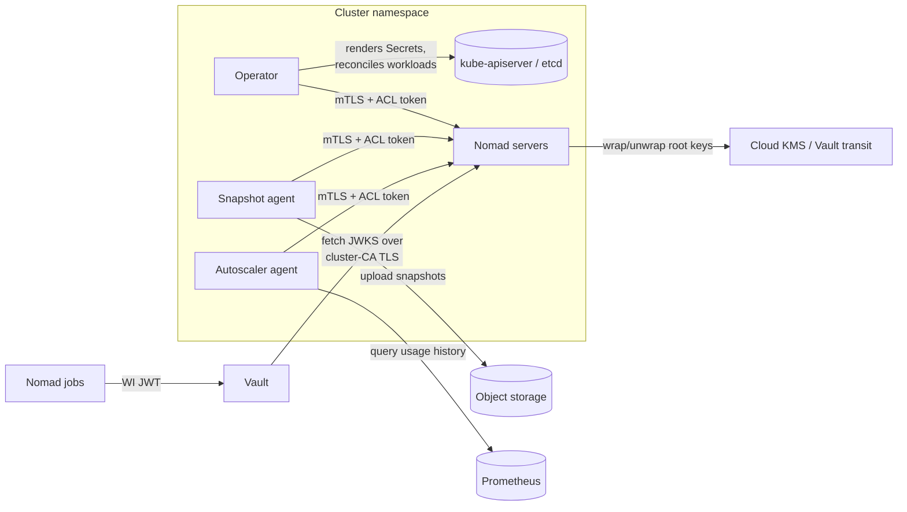

# Nomad Enterprise Operator Threat Model

This document describes the threats *introduced or materially changed* by
deploying Nomad Enterprise via this operator, and their mitigations.

Threats inherent to operating Nomad itself - the power of a management ACL
token, the sensitivity of Raft snapshots, workload-identity role scoping -
exist identically on any deployment substrate and are covered by
[Nomad's security model](https://developer.hashicorp.com/nomad/docs/concepts/security)
and are not restated here.

## Executive summary and recommendations for secure use

The operator changes Nomad's security posture in three ways: it relocates
Nomad's secret material into Kubernetes Secrets (and therefore etcd), it
introduces a controller identity whose compromise spans every managed
cluster, and it makes CR write access a control channel over the operand.
Accordingly:

- Enable [encryption at rest for Kubernetes Secrets](https://kubernetes.io/docs/tasks/administer-cluster/encrypt-data/).
  Secret material that would live on server host disks in a VM deployment
  lives in etcd here; etcd encryption is the single control covering all of
  it.
- Treat namespace-level Secret **read** and CR **write** as equivalent to
  full control of the Nomad cluster in that namespace, and grant both
  accordingly. This equivalence is created by the operator, not by Nomad.
- Run the operator in its own namespace with no other workloads, and grant
  its ServiceAccount nothing beyond the bundled role.
- Treat ConfigMap write access in operand namespaces as security-sensitive:
  the trust bundle mechanism makes it an egress-MITM vector.
- Reference operand images by digest where the registry is not fully
  trusted; the image reference in the CR is a mutable tag by default.

## Terminology

| Term | Definition |
|---|---|
| Operator | The Nomad Enterprise Operator controllers, deployed via OLM or manifests. |
| Operand | The Nomad Enterprise server cluster (StatefulSet) and auxiliary workloads (snapshot agent, autoscaler) the operator manages. |
| Cluster CR | A `NomadCluster` custom resource; similarly `NomadSnapshot` and `NomadAutoscaler`. |
| Trust bundle | The CA ConfigMap mounted over the operand's system trust store for egress TLS. |

## Scope and limitations

In scope: the operator's controllers, the Kubernetes objects it creates,
and the ways Kubernetes RBAC, etcd, and the CR API become paths to the
operand's secret material and behaviour.

Out of scope: Nomad's own threat surface (job sandboxing, ACL semantics,
keyring and snapshot design, workload identity), Vault's threat model,
Kubernetes control-plane compromise beyond what RBAC and etcd encryption
address, and supply-chain threats to upstream HashiCorp images. The
operator's server-side workload-identity surface (`vaults[].defaultIdentity`)
carries no secrets (audiences and TTLs only) and adds no threat
beyond Nomad's own.

## Detailed description

The operator watches its CRs cluster-wide and reconciles, per
`NomadCluster`: a CA and server TLS material, a gossip key, the rendered
server configuration, ACL bootstrap and operator tokens, keyring
configuration, and Services/StatefulSet. Per `NomadSnapshot`, it renders a
snapshot-agent configuration and Deployment/Job.

The secret material this places in each namespace - the relocation this
model is about:

| Object | Contents | Custody |
|---|---|---|
| `<cluster>-config` (Secret) | Rendered `server.hcl`: gossip key, inline keyring Vault tokens | Operator-rendered |
| `<cluster>-ca`, `<cluster>-tls` (Secrets) | CA cert + private key; server cert + key | Operator-generated (or user-supplied CA) |
| `<cluster>-gossip` (Secret) | Serf encryption key | Operator-generated or user-supplied |
| `<cluster>-acl-bootstrap`, `<cluster>-operator-status`, `<cluster>-operator-management` (Secrets) | Bootstrap, scoped-read, and management ACL tokens | Operator-managed |
| `<cluster>-keyring-token` (Secret) | Vault token for transit keyrings | Operator-managed |
| Keyring / snapshot `credentialsSecretRef` (Secrets) | Cloud KMS and object-storage credentials | User-managed |
| `<snapshot>-snapshot-config` (Secret) | Agent config with embedded storage credentials | Operator-rendered (see [credential custody](../reference/nomadsnapshot.md#credential-custody)) |
| License Secret | Nomad Enterprise license | User-managed |
| `<cluster>-trust-bundle` (ConfigMap) | CA bundle replacing the operand's system trust store | User-supplied or OpenShift-injected; integrity-sensitive, not secret |

## Threats

### Threats introduced by the operator

| ID | Threat | Categories | Description | Mitigation |
|---|---|---|---|---|
| 1 | Operator ServiceAccount compromise | Elevation of privilege | The operator's SA reads and writes Secrets and workloads in every namespace containing its CRs. This identity does not exist in a VM deployment; an attacker executing as the operator controls every managed Nomad cluster at once - reading management tokens, rewriting server config, or redirecting snapshot uploads. | Dedicated namespace; no bindings beyond the bundled role; Pod Security `restricted` (operator and operand both run under it); audit logging on the SA. |
| 2 | CR write as a control channel | Tampering, elevation of privilege | Whoever can write a `NomadCluster`/`NomadSnapshot` directs the operator: pointing `credentialsSecretRef` at other Secrets in the namespace, redirecting snapshot uploads to attacker storage, or swapping the operand image - exfiltration and code execution with the operator as the confused deputy. On a VM these actions require host or Nomad API access; here they require only CR write. | CRs only reference Secrets in their own namespace, bounding the blast radius; grant CR write as if it were Secret read plus workload admin - the reach is equivalent. |
| 3 | Operator-generated CA disclosure | Spoofing, tampering | The operator mints and stores the cluster CA - key included - as a Secret. Vault trusts this CA for the JWKS endpoint backing workload identity, so possession allows impersonating the Nomad API to clients and serving a forged JWKS, converting to secret access under any Vault role trusting that auth mount. In a VM deployment the CA's location is the administrator's choice; with the operator it lives in etcd. | etcd encryption; namespace RBAC; per-cluster CA so compromise does not cross clusters; a user-supplied CA (rotatable by spec update) keeps the key out of operator custody entirely. |
| 4 | Rendered-artifact credential duplication | Information disclosure | The operator renders configs that embed values from their source Secrets: `<cluster>-config` (gossip key, keyring Vault tokens) and `<snapshot>-snapshot-config` (storage credentials). Each value exists in two objects - doubled audit and disclosure surface that a hand-rolled deployment would not have. | Rendered artifacts are Secret-class (the [credential custody model](../reference/nomadsnapshot.md#credential-custody)); etcd encryption and namespace RBAC cover source and rendered copies identically; rotation converges within one reconcile. |
| 5 | Trust bundle poisoning | Tampering, spoofing | The trust bundle ConfigMap *replaces* the operand's system roots - a mechanism the operator introduces. ConfigMap write in the namespace therefore allows inserting an attacker CA and intercepting egress TLS: cloud KMS, object storage, Vault, and the autoscaler's DAS Prometheus source. | Treat ConfigMap write in operand namespaces as security-sensitive; on OpenShift the injected bundle is maintained by the platform's network operator. |
| 6 | Operand image substitution | Tampering | The CR's image reference is a mutable tag by default; a tag move or poisoned registry executes attacker code with all mounted Secrets. The operator makes this a declarative, reconciled path: the substitution is applied by the operator's own reconcile. | Pin by digest where the registry cannot be fully trusted; the release process gates on operand version currency, so digests can be updated deliberately rather than floating. |
| 7 | Wildcard server certificate SANs | Spoofing | The server certificate covers pod names with a wildcard (`*.<cluster>-headless.<ns>...`) rather than enumerated ordinals. A stolen key therefore validates for arbitrary labels under the cluster's headless domain, not just the N real servers. Key possession already meant full server impersonation (every resolvable name was covered), the wildcard cannot validate for any other service's domain, and server-to-server authorization uses the `server.<region>.nomad` SAN, which is unchanged. No component may make an authorization decision by matching pod FQDNs against the server certificate: under a wildcard that check authorizes names with no server behind them. | Per-ordinal SANs re-issue the certificate on scale and roll the surviving servers mid-scale-up, stranding quorum reformation, so enumeration is not available as a mitigation. Keep authorization on `server.<region>.nomad`; treat the TLS Secret with the custody threat 3 assigns it. |

### Threats from relocating Nomad's secrets into Kubernetes

| ID | Threat | Categories | Description | Mitigation |
|---|---|---|---|---|
| 8 | etcd at rest | Information disclosure | Secret material that a VM deployment keeps on server host disks - gossip key, CA key, ACL tokens, keyring and storage credentials - lives in etcd and every etcd backup. | Enable etcd encryption; keep etcd backups in the same custody regime as the Secrets themselves. |
| 9 | Namespace RBAC as the perimeter | Information disclosure, elevation of privilege | Secret read in the namespace yields everything in the inventory above; namespace admin additionally reaches CRs, ConfigMaps, and (via the aggregated ClusterRole) OLM objects where the operator is deployed namespace-scoped. Host-level access controls that would partition these on a VM do not apply. | This is the intended boundary - one namespace, one Nomad cluster, one admin scope. Do not co-locate tenants of different trust levels; audit `get`/`list` on Secrets. |
| 10 | Node compromise | Information disclosure | Secrets mounted into operand pods exist in kubelet tmpfs on whichever nodes schedule them - a broader and more dynamic host set than a pinned VM fleet. | Standard node hardening; tmpfs-backed Secret volumes (the Kubernetes default); constrain operand scheduling where node trust varies. |

## References

- [Credential custody and snapshot credential delivery](../reference/nomadsnapshot.md#credential-custody)
- [Nomad security model](https://developer.hashicorp.com/nomad/docs/concepts/security)
- [Kubernetes: Encrypting Secret Data at Rest](https://kubernetes.io/docs/tasks/administer-cluster/encrypt-data/)
- [Vault Secrets Operator threat model](https://github.com/hashicorp/vault-secrets-operator/blob/main/docs/threat-model/README.md)

