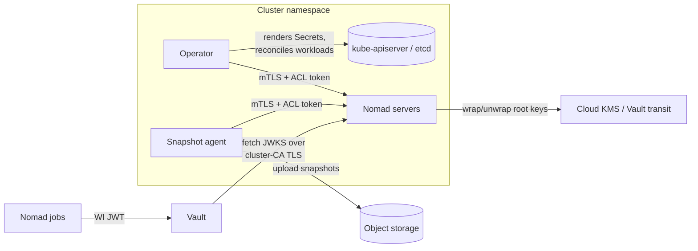

# Nomad Enterprise Operator Threat Model

This document describes the trust boundaries, secret inventory, and threats
relevant to running the Nomad Enterprise Operator, together with the
mitigations the operator provides and those the cluster administrator must
provide. It follows the structure of the
[Vault Secrets Operator threat model](https://github.com/hashicorp/vault-secrets-operator/blob/main/docs/threat-model/README.md).

## Executive summary and recommendations for secure use

- Enable [encryption at rest for Kubernetes Secrets](https://kubernetes.io/docs/tasks/administer-cluster/encrypt-data/).
  Every sensitive artifact the operator manages is a Secret; etcd encryption
  is the single control that covers all of them.
- Treat namespace-level Secret read access as equivalent to full control of
  the Nomad cluster in that namespace. The management ACL token, the CA
  private key, the gossip key, and all storage and KMS credentials live
  there. Scope RBAC accordingly and audit `get`/`list` on Secrets.
- Run the operator in its own namespace with no other workloads, and grant
  its ServiceAccount nothing beyond the bundled role.
- Prefer cloud KMS or Vault transit keyrings over the default AEAD keyring:
  with `aead`, the root key material is stored inside the Raft snapshot, so
  possession of a snapshot is possession of the keyring.
- Prefer short TTLs on workload identities and per-job Vault roles bound to
  claims (`nomad_job_id`, namespace) over broad shared roles.
- Reference operand images by digest in air-gapped or high-assurance
  environments; tags are mutable.
- Storage and KMS credentials referenced by `credentialsSecretRef` should be
  scoped to exactly the operations the operator needs (documented per
  provider in the [README](../../README.md)) — never account-level keys with
  broader reach than the bucket/key they serve.

## Terminology

| Term | Definition |
|---|---|
| Operator | The Nomad Enterprise Operator controllers and webhooks, deployed via OLM or manifests. |
| Operand | The Nomad Enterprise server cluster (StatefulSet) and auxiliary workloads (snapshot agent, autoscaler) the operator manages. |
| Cluster CR | A `NomadCluster` custom resource; similarly `NomadSnapshot` and `NomadAutoscaler`. |
| Keyring | Nomad's root encryption keys, wrapped by AEAD (default), cloud KMS, or Vault transit. |
| Workload identity (WI) | Signed JWTs Nomad issues to jobs, validated by Vault against Nomad's JWKS endpoint. |
| Trust bundle | The CA ConfigMap mounted over the operand's system trust store for egress TLS. |

## Scope and limitations

In scope: the operator's controllers, the Kubernetes objects it creates, and
the credential and trust flows between the operator, the operand, Vault,
cloud KMS, and object storage.

Out of scope: threats internal to Nomad Enterprise itself (job sandboxing,
ACL semantics), Vault's own threat model, Kubernetes control-plane
compromise beyond what RBAC and etcd encryption address, and supply-chain
threats to upstream HashiCorp images.

## Detailed description

The operator watches its CRs cluster-wide and reconciles, per
`NomadCluster`: a CA and server TLS material, a gossip key, the rendered
server configuration, ACL bootstrap and operator tokens, keyring
configuration, and Services/StatefulSet. Per `NomadSnapshot`, it renders a
snapshot-agent configuration and Deployment/Job. All communication with the
Nomad API uses mTLS plus an ACL token.

Secrets the operator creates or consumes, per namespace:

| Object | Contents | Custody |
|---|---|---|
| `<cluster>-config` (Secret) | Rendered `server.hcl`: gossip key, inline keyring Vault tokens | Operator-rendered |
| `<cluster>-ca`, `<cluster>-tls` (Secrets) | CA cert + private key; server cert + key | Operator-generated (or user-supplied CA) |
| `<cluster>-gossip` (Secret) | Serf encryption key | Operator-generated or user-supplied |
| `<cluster>-acl-bootstrap`, `<cluster>-operator-status`, `<cluster>-operator-management` (Secrets) | Bootstrap, scoped-read, and management ACL tokens | Operator-managed |
| `<cluster>-keyring-token` (Secret) | Vault token for transit keyrings | Operator-managed |
| Keyring / snapshot `credentialsSecretRef` (Secrets) | Cloud KMS and object-storage credentials | User-managed |
| `<snapshot>-snapshot-config` (Secret) | Agent config with embedded storage credentials | Operator-rendered (see [credential custody](../../README.md)) |
| License Secret | Nomad Enterprise license | User-managed |
| `<cluster>-trust-bundle` (ConfigMap) | CA bundle replacing the operand's system trust store | User-supplied or OpenShift-injected; integrity-sensitive, not secret |

## Threats

### Threats specific to the operator

| ID | Threat | Categories | Description | Mitigation |
|---|---|---|---|---|
| 1 | Operator ServiceAccount compromise | Elevation of privilege | The operator's SA can read and write Secrets and workloads in every namespace containing its CRs. An attacker executing as the operator controls every managed Nomad cluster: it can read management tokens, rewrite server config, or point snapshot uploads at attacker storage. | Dedicated namespace; no additional bindings beyond the bundled role; Pod Security `restricted` (the operator and operand both run under it); audit logging on the SA. |
| 2 | Management ACL token disclosure | Information disclosure, elevation of privilege | `<cluster>-operator-management` is a Nomad management token — full API control, including submitting jobs that execute on clients. | etcd encryption; namespace RBAC on Secrets; the operator uses the scoped `operator-status` token where read-only suffices. |
| 3 | Cluster CA private key disclosure | Spoofing, tampering | `<cluster>-ca` signs all server certs and secures the JWKS endpoint Vault trusts for workload identity. Possession allows impersonating the Nomad API to clients and to Vault — including serving a forged JWKS, which converts to arbitrary Vault access under any role trusting that auth mount. | etcd encryption; namespace RBAC; per-cluster CA (compromise does not cross clusters); user-supplied CA rotation is a spec update away. |
| 4 | Rendered configuration disclosure | Information disclosure | `<cluster>-config` embeds the gossip key and keyring Vault tokens; `<snapshot>-snapshot-config` embeds storage credentials. Both duplicate values that also exist in their source Secrets — two objects per value to audit and protect. | Both artifacts are Secret-class deliberately (documented as the credential custody model in the README); etcd encryption and namespace RBAC cover source and rendered copies identically. |
| 5 | Trust bundle poisoning | Tampering, spoofing | The trust bundle ConfigMap *replaces* the operand's system roots. An attacker with ConfigMap write in the namespace can insert a CA they control and man-in-the-middle the operand's egress — cloud KMS, object storage, Vault. | ConfigMaps carry the same namespace RBAC boundary as Secrets — treat CM write access as security-sensitive in operand namespaces; on OpenShift the injected bundle is maintained by the platform operator. |
| 6 | Malicious or hijacked CR | Tampering, elevation of privilege | Whoever can write a `NomadCluster`/`NomadSnapshot` directs the operator: pointing `credentialsSecretRef` at other Secrets in the namespace, or snapshot uploads at attacker-controlled endpoints, exfiltrates data with the operator as the deputy. | CRs only reference Secrets in their own namespace — the blast radius is bounded by namespace RBAC; treat CR write access as equivalent to Secret read access when granting roles. |

### Threats specific to Kubernetes and Kubernetes Secrets

| ID | Threat | Categories | Description | Mitigation |
|---|---|---|---|---|
| 7 | etcd at rest | Information disclosure | Without encryption at rest, every Secret above is plaintext in etcd and its backups. | Enable etcd encryption; include etcd backups in the same custody regime as the Secrets themselves. |
| 8 | Node compromise | Information disclosure | Secrets mounted into operand pods exist in kubelet tmpfs; a root attacker on the node reads them, along with the operand's in-memory state. | Standard node hardening; tmpfs (never disk) for Secret volumes is the Kubernetes default; restrict node access. |
| 9 | Namespace administrator reach | Elevation of privilege | Namespace admin implies all of the above per-namespace: Secrets, CRs, ConfigMaps, and (via the aggregated ClusterRole) OLM objects where the operator is deployed namespace-scoped. | This is the intended trust boundary — one namespace, one Nomad cluster, one admin scope. Do not co-locate tenants with different trust levels in one namespace. |

### Threats specific to the operand data path

| ID | Threat | Categories | Description | Mitigation |
|---|---|---|---|---|
| 10 | Snapshot contents | Information disclosure | A Raft snapshot contains the full server state: job specs, Variables, ACL policies. With the default AEAD keyring, it also contains the root key material — the snapshot decrypts itself. | Use a KMS or transit keyring so snapshots are useless without the external key; scope object-storage credentials to the bucket; treat the bucket as Secret-class custody. |
| 11 | KMS/transit credential disclosure | Information disclosure, elevation of privilege | Keyring credentials unwrap root keys. Combined with snapshot access (10), this reconstructs cluster state; alone, it allows decrypt/sign operations against the external key. | Scope credentials to the specific key and the wrap/unwrap (or encrypt/decrypt) operations only; rotate via the source Secret — the operator rolls the operand on change. |
| 12 | Workload identity misconfiguration | Spoofing, elevation of privilege | An over-broad Vault role (no bound claims, wide policies) lets any job in the cluster obtain secrets intended for one job. The server-side `default_identity` is deliberately secret-free, but audiences and TTLs set there apply to every job that does not override them. | Bind Vault roles to `nomad_job_id` and namespace claims; one role per workload; keep `default_identity` TTLs short; policy verbs must match the operations templates actually perform (creds endpoints with arguments are `update`, not `read`). |
| 13 | Operand image substitution | Tampering | The operand image reference in the CR is a mutable tag by default; a poisoned registry or tag move executes attacker code with access to all mounted Secrets. | Pin by digest where the registry cannot be fully trusted; the operator's version-currency release gate tracks upstream Nomad versions, so digests can be updated deliberately rather than floating. |

## References

- [Credential custody and snapshot credential delivery](../../README.md)
- [Kubernetes: Encrypting Secret Data at Rest](https://kubernetes.io/docs/tasks/administer-cluster/encrypt-data/)
- [Nomad workload identity](https://developer.hashicorp.com/nomad/docs/concepts/workload-identity)
- [Nomad keyring / key management](https://developer.hashicorp.com/nomad/docs/operations/key-management)
- [Vault Secrets Operator threat model](https://github.com/hashicorp/vault-secrets-operator/blob/main/docs/threat-model/README.md) (structural template)
